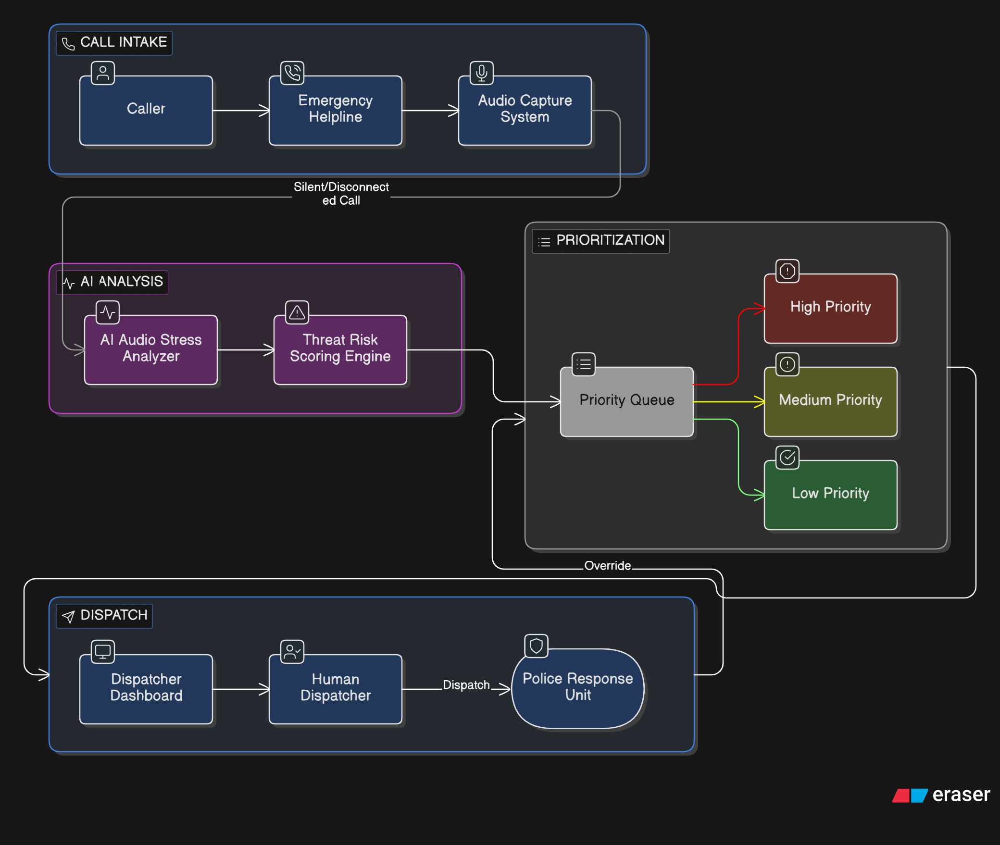

<h1 align="center">🚨 PRIORITY-112</h1>

<h3 align="center">Smart Emergency Dispatch using Voice Stress Analysis</h3>

 

<!-- ADD PROJECT IMAGE BELOW -->

 

<h2>🧩 Problem Statement</h2>

Emergency helplines such as <strong>112 / 100 / 911</strong> receive thousands of calls every day.
Dispatch operators must quickly decide which calls are life-threatening and which are not —
often within seconds and under heavy pressure.

However:

<ul>
  <li>Panic, screaming, trembling voices, or background chaos make it hard to understand callers</li>
  <li>Silent or abruptly disconnected calls often get deprioritized</li>
  <li>Human judgment varies between operators during high call volumes</li>
</ul>

As a result, <strong>genuine emergency cases may experience delayed police response</strong>,
especially when callers cannot communicate clearly.

<h2>💡 Our Solution</h2>

<strong>PRIORITY-112</strong> introduces an <strong>AI-assisted layer</strong> for emergency dispatch centers
that analyzes <strong>real-time call audio</strong> to detect
<strong>high-stress and high-threat acoustic patterns</strong>.

Instead of relying only on <em>what callers say</em>, the system listens to <em>how they sound</em>.

The AI:

<ul>
  <li>Analyzes voice stress indicators such as pitch variation, trembling, intensity, and background noise</li>
  <li>Assigns a <strong>threat score</strong> to each call</li>
  <li>Automatically prioritizes high-risk calls on the dispatcher dashboard</li>
</ul>

The system <strong>assists dispatchers</strong> — it never replaces human decision-making.

<h2>🛠️ Technology Stack</h2>

<h3>Audio Processing & AI</h3>

<ul>
  <li><strong>Python</strong></li>
  <li><strong>Librosa</strong> – Audio feature extraction</li>
  <li><strong>NumPy / Pandas</strong> – Data processing</li>
  <li><strong>Scikit-learn</strong> – Model training (SVM / Random Forest)</li>
</ul>

<h3>Model & Logic</h3>

<ul>
  <li>Feature-based audio classification</li>
  <li>Threat scoring instead of emotion labeling</li>
  <li>Offline training with real-time inference readiness</li>
</ul>

  

<h2>🏁 Summary</h2>

<strong>PRIORITY-112</strong> enhances emergency response by helping dispatchers identify
<strong>who needs help first</strong>, even when callers are panicked, unclear, or unable to speak.

By listening to <strong>stress in the voice</strong> — not just words —
the system ensures that <strong>limited police resources reach those in immediate danger faster</strong>.

  <em>Hackathon Project • System-level Safety Innovation</em>

